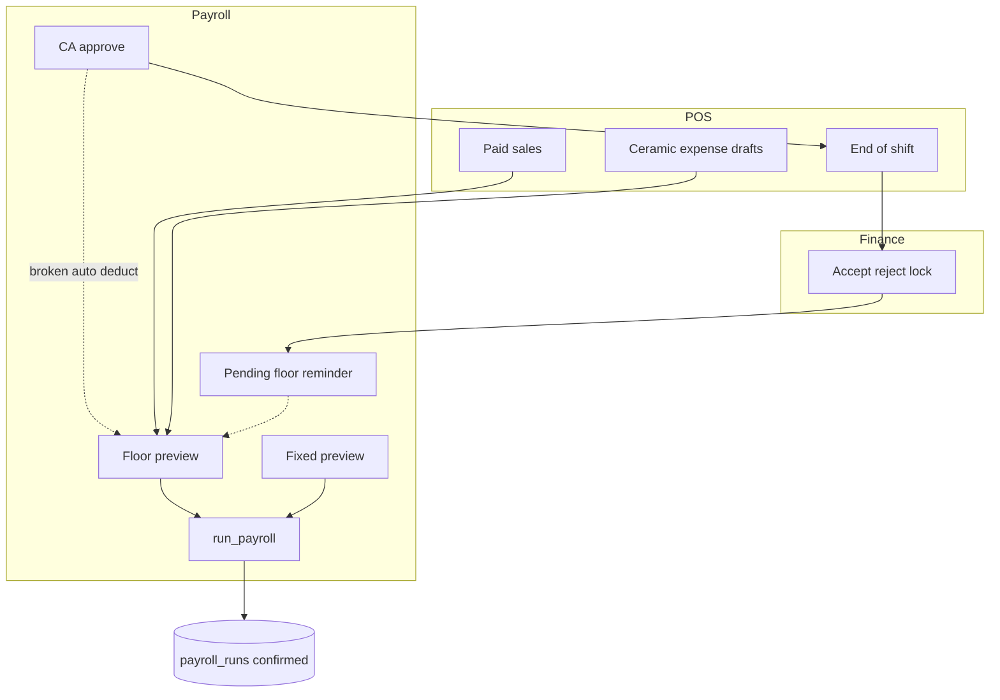
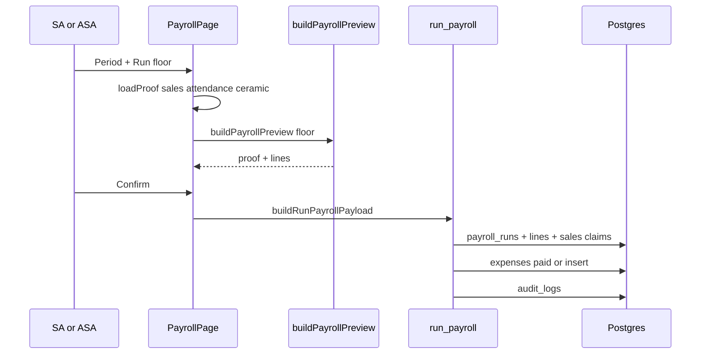
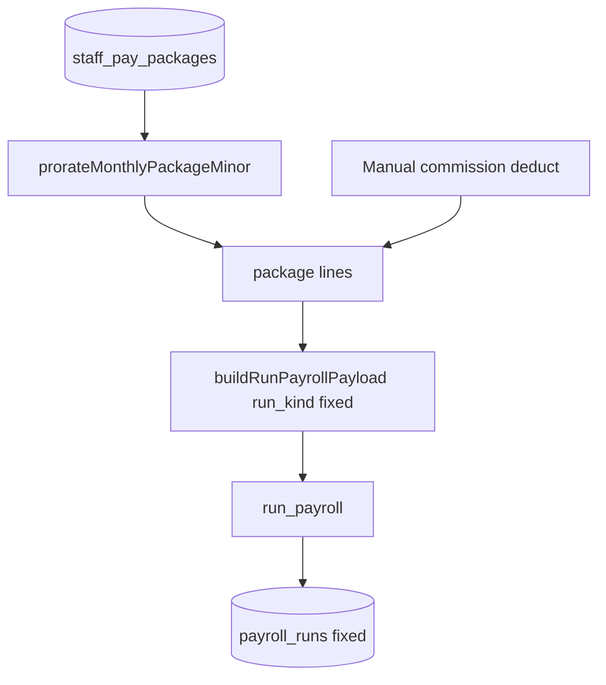
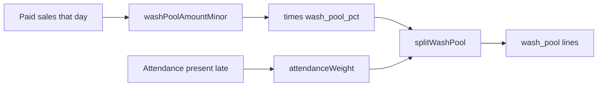
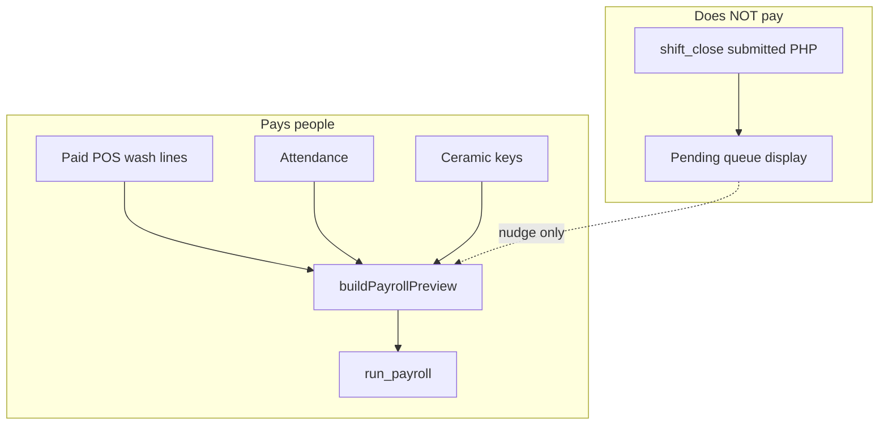
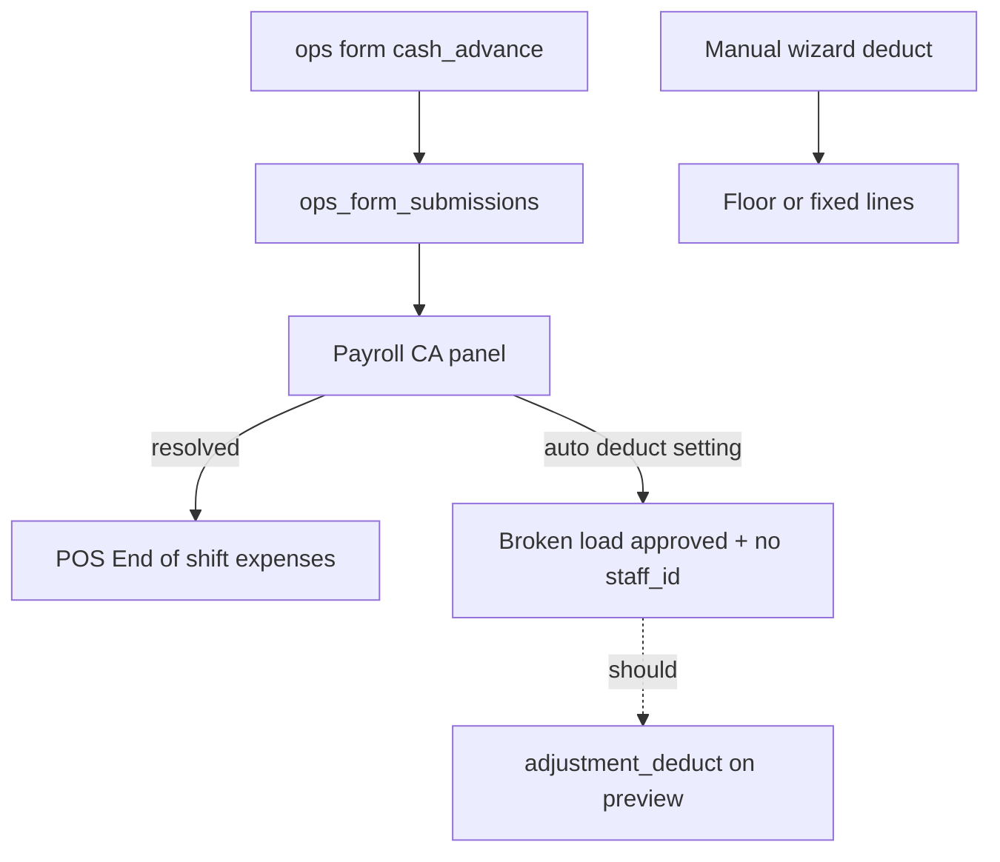
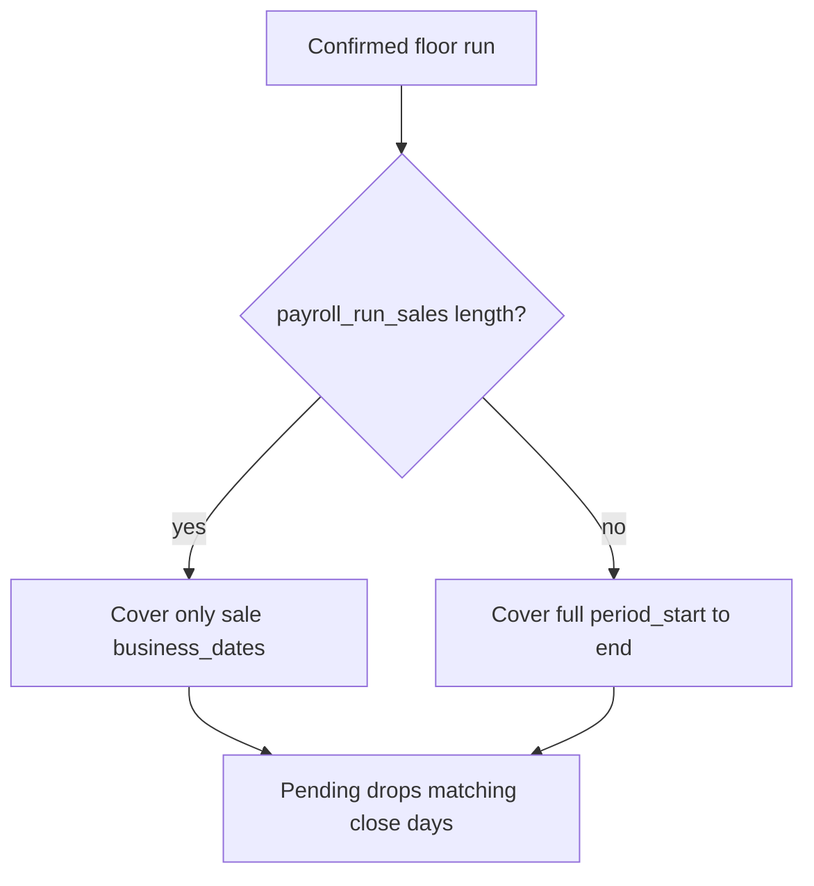
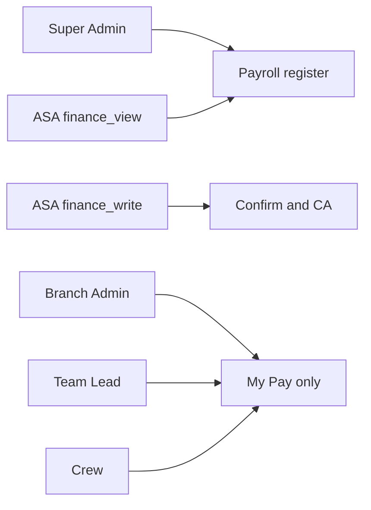
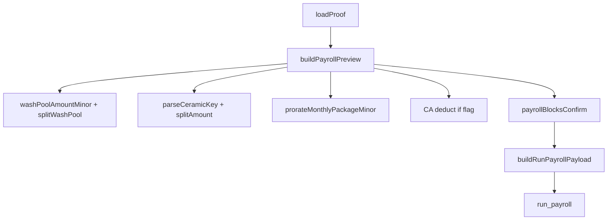

# 10 — Flowcharts (interactions, functions, dataflow)

**Visual viewer (open in browser):** [10-FLOWCHARTS.html](./10-FLOWCHARTS.html) — all diagrams rendered with navigation.

**PDF (print / share):** [10-FLOWCHARTS.pdf](./10-FLOWCHARTS.pdf) — regenerate with `npm run generate:flowcharts-pdf`.

Markdown below is the source of truth for edits; sync changes into the HTML file when diagrams change.

---

## F1 — System context

---

## F2 — Floor confirm sequence

---

## F3 — Fixed confirm

---

## F4 — Wash pool day

---

## F5 — Pending vs pay truth

---

## F6 — Cash advance paths

---

## F7 — Coverage claimed sales

---

## F8 — Role access

---

## F9 — Function map (preview)

---

## How to re-audit

1. Run a floor window with known paid sales + attendance; confirm claimed sales.
2. Accept a close; verify pending; confirm coverage after claim.
3. Approve a CA; verify close math; verify payroll does **not** auto-deduct until fixed.
4. Post a fixed package; check My Pay label.
5. Log in [AUDIT-LOG.md](./AUDIT-LOG.md).
