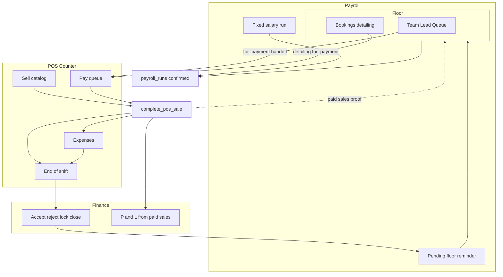
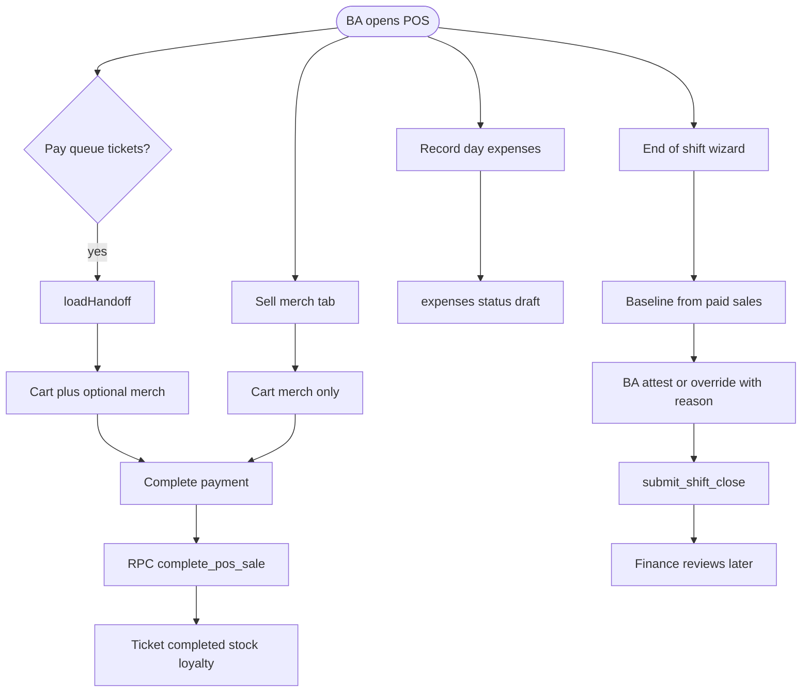
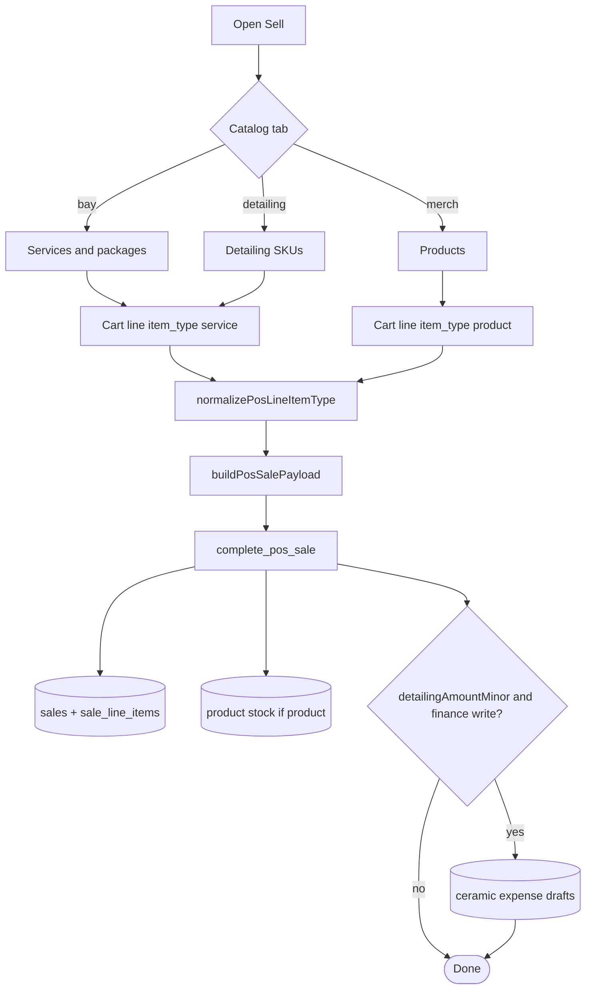
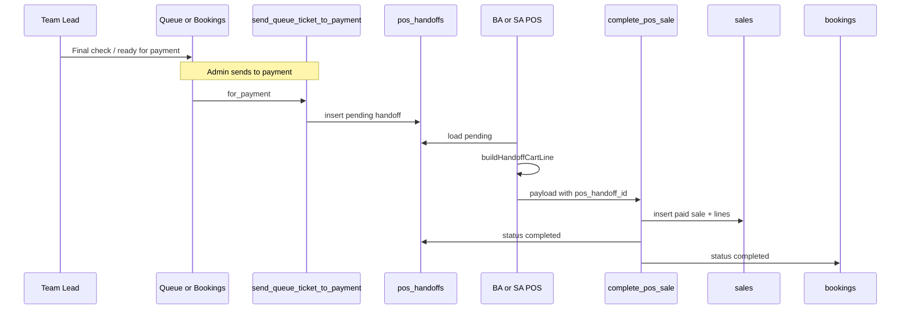
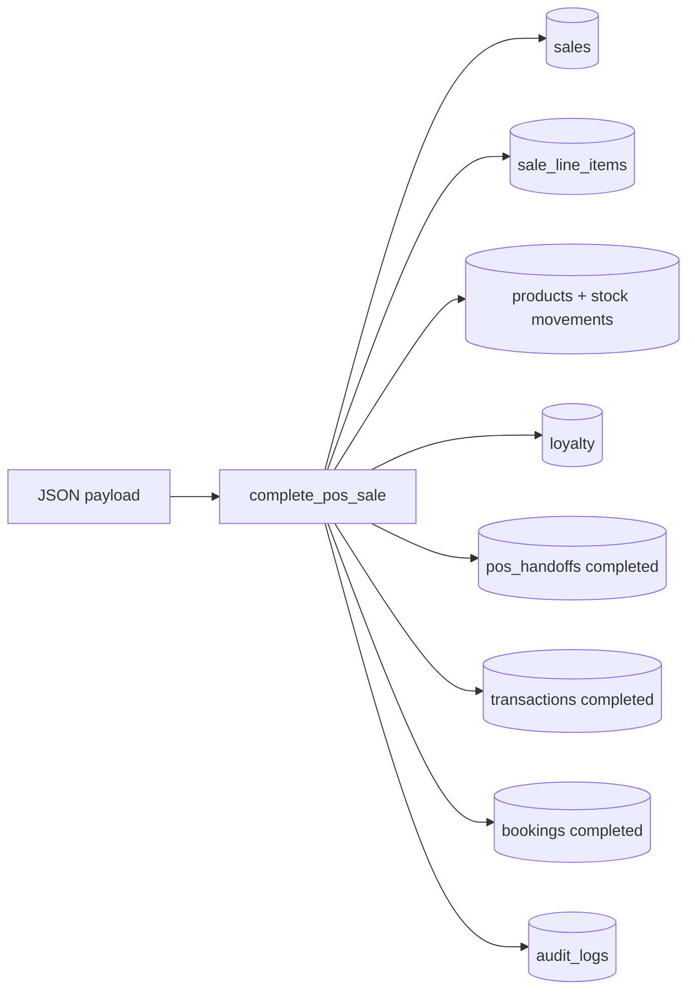
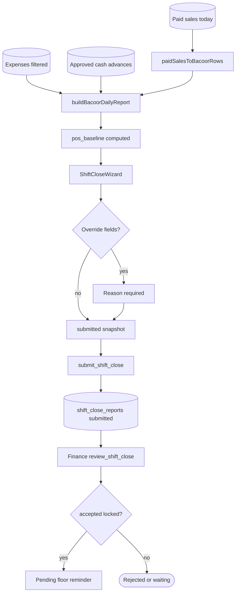
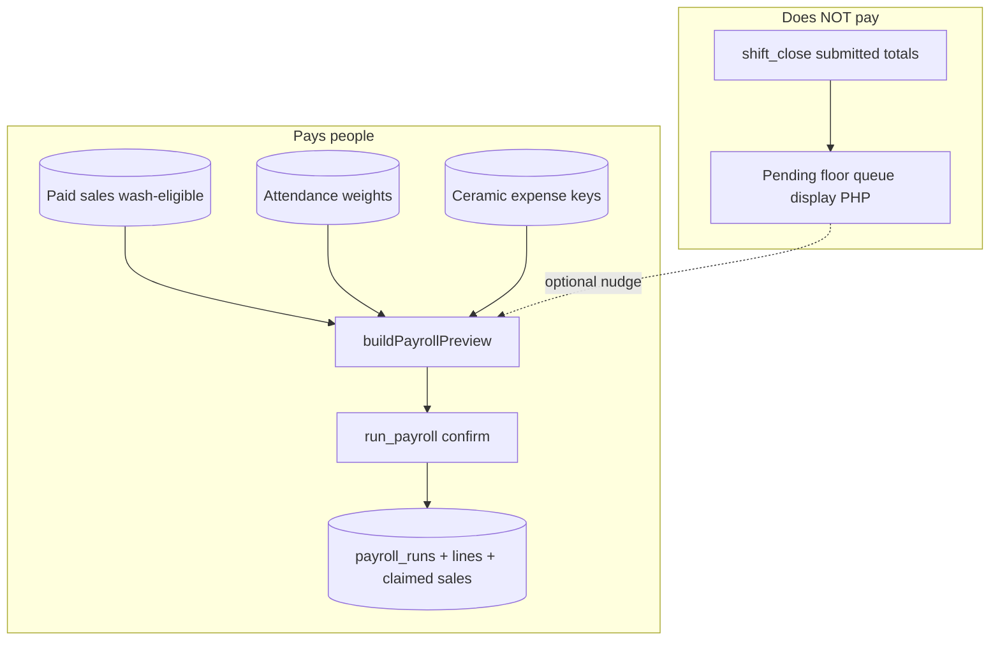
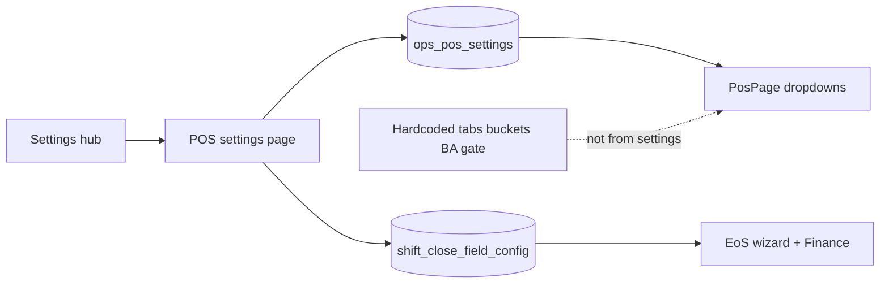
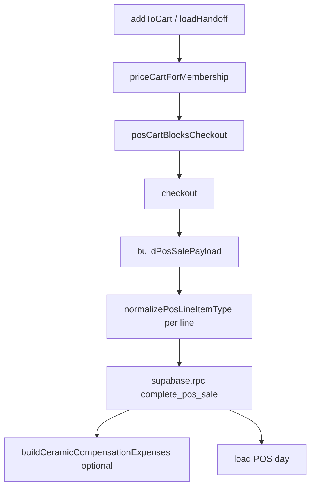
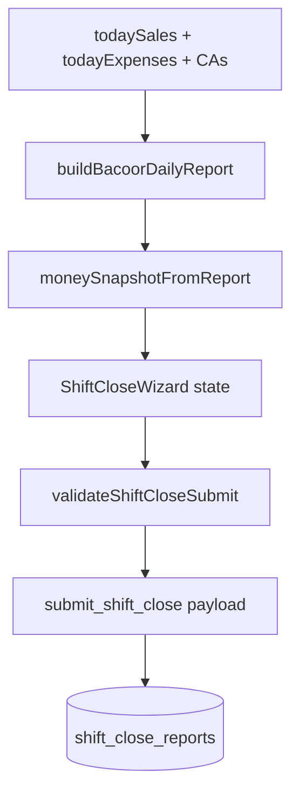

# 09 — Flowcharts (interactions, functions, dataflow)

**Visual viewer (open in browser):** [09-FLOWCHARTS.html](./09-FLOWCHARTS.html) — all diagrams rendered with navigation.

**PDF (print / share):** [09-FLOWCHARTS.pdf](./09-FLOWCHARTS.pdf) — regenerate with `npm run generate:flowcharts-pdf`.

Markdown below is the source of truth for edits; sync changes into the HTML file when diagrams change.

---

## F1 — System context (POS in Hakum)

---

## F2 — BA day loop (straightforward path)

---

## F3 — SA / ASA walk-in catalog checkout

---

## F4 — Queue / booking → Pay queue → paid

---

## F5 — complete_pos_sale write set

---

## F6 — End of shift data truth

---

## F7 — Payroll: what money path is real

---

## F8 — Settings vs runtime

---

## F9 — Function call map (checkout)

---

## F10 — Function call map (End of shift)

---

## How to re-audit with these charts

1. Pick a customer journey (walk-in merch, queue wash, detailing booking).
2. Walk F2–F4 against a staging branch.
3. Confirm F7: after confirm payroll, claimed sales clear pending days without trusting close ₱.
4. Log findings in [AUDIT-LOG.md](./AUDIT-LOG.md).
