# Daily Sheet — owner and Branch Admin guide

One sheet per branch per day replaces End of shift, Payroll and My pay.
The Branch Admin fills it in at the POS; Super Admin (or an ASA with Finance access) approves it in Finance. **Crew are paid only after approval.**

Diagrams: [workflow](../architecture/daily-sheet.workflow.html) · [status lifecycle](../architecture/daily-sheet.lifecycle.html)

## Where it lives

| Who | Where | What they do |
|---|---|---|
| Branch Admin | **POS → Daily sheet** | Fill in expenses, pay crew, cash advances, count cash, Submit |
| Super Admin · ASA (finance) | **Finance → Daily sheets** | Read the same sheet, Approve or Return with a note |
| Branch Admin | **POS → Today** | Sales by hour vs yesterday, sheet status, cars waiting to pay |
| Super Admin · ASA | **Floor Board → Money** | Net sales today vs yesterday, month profit, sheets waiting, over/short alerts |

## Filling it in (Branch Admin)

1. **Money in** — sales fill in by themselves from paid POS tickets. You cannot type them.
2. **Money out** — add each expense: what it was, the account, the amount, and a receipt photo if you have one.
3. **Pay crew** — everyone who clocked in today has a row with a suggested amount. Change it if needed; a change needs a short reason.
4. **Cash advances** — record cash given to a staff member (released) or paid back (repaid).
5. **Cash in drawer** — enter the opening float and the cash you counted.
6. **Submit** — the button stays grey until every section has a ✓. The list under it says what is missing.

If the sheet comes back **Returned**, the reason is shown at the top. Fix it and Submit again.
When it is **Approved** you get a push: *Approved: release pay*. Pay the crew then.

## Approving (Super Admin · ASA)

- A push arrives when a sheet is submitted. Open **Finance → Daily sheets**.
- Check the summary: net sales, total expenses, net profit, over/short.
- **Approve** posts every expense and salary line to the books (once — approving again does nothing new).
- **Return** sends it back to the Branch Admin with your note.
- Super Admin can **Reopen** an approved sheet; its posted lines are voided and it goes back to *Returned*.

## Formulas

All numbers come from `src/lib/dailySheet.js`, so the POS and Finance always agree.

| Line | Formula |
|---|---|
| Gross sales | sum of paid line totals before discounts |
| Net sales | gross sales − discounts − refunds |
| Average sale | net sales ÷ transactions |
| Total expenses | daily expenses + salaries |
| Net profit (day) | net sales − total expenses |
| Expected cash | opening float + cash sales + CA repaid − cash expenses − salaries − CA released |
| Over / short | counted cash − expected cash (a note is required when it is not zero) |

Cash advances are **not** costs. They move cash in the drawer but never change profit.

### Cash advances, start to finish

1. A crew member asks in **Planner → Forms → Cash advance**. Their branch's Branch Admin gets a push (*Cash advance request*) that opens **POS → Daily sheet**.
2. On the sheet, the request shows as a one-tap chip (e.g. *+ Juan · ₱300.00*). Tapping it adds a *Given out* line; the cash leaves the drawer.
3. Repayments are *Paid back* lines. Both change **Expected cash** only.
4. SA / ASA approve the advance together with the sheet. Nothing is posted to the P&L for advances.

Suggested salaries use the rules in **Settings → Daily sheet rules** (`compensation_settings`):
wash pool = car wash sales × pool %, split by attendance weight (Team Leads excluded);
ceramic and detailer splits as before; Team Leads get their **daily rate** (`staff_profiles.daily_rate_minor`).

## Accounts (Xero codes)

| Code | Account |
|---|---|
| 10 | Meals and Entertainment |
| 11 | Apparel Inventory |
| 12 | Chemical and Other Inventory |
| 13 | Coffee and Other Supplies |
| 14 | Employee Salary and Incentives |
| 15 | Equipments and Tools |
| 16 | Labor and Repair Maintenance |
| 17 | Marketing Expenses |
| 18 | Online Expenses and Others |
| 19 | Rent and Operating Utilities |
| 20 | Shipping and/or Delivery Fees |
| 21 | Taxes and Accounting Fees |

Salaries post under **14**. Monthly salaries (office, Branch Admins) are entered as **Bills** in Finance under 14.

Only Super Admin or an ASA with `finance_write` can set a staff member's **daily rate** — a database trigger (`staff_profiles_guard_daily_rate`) refuses anyone else, even if they can edit other staff fields. The same people edit **Settings → Daily sheet rules**; other ASAs see the rules read-only.

## Finance (Xero-style)

Tabs: **Home · Daily sheets · Sales · Bills · P&L · Reports**. Every filter (dates, branch, compare) is saved in the URL, so a copied link opens the same view.

- **Home** — accounts watchlist (this month, year to date), net profit year to date chart, sheets waiting, recent payments.
- **Sales** — gross, count, average, net, refunds, discounts with % change; Today / Week / Month / Quarter / Year; hourly vs prior day.
- **Bills** — New bill: From, Date, Due date, Reference, then lines (Item, Description, Qty, Unit price, Account, Branch).
- **P&L** — by month, compare 1–12 previous months, quarters or years, or compare branches. Export CSV, Excel or PDF.

## Data and security

- Tables: `daily_sheets` (one per branch + date) and `daily_sheet_lines` (expense, salary, ca_release, ca_repay).
- Functions: `save_daily_sheet`, `submit_daily_sheet`, `review_daily_sheet`, `reopen_daily_sheet`.
- Approve writes `expenses` rows with status `paid`, keyed per sheet line, so the P&L views pick them up.
- Branch Admins see only their own branches. RLS stays on.
- Old End of shift reports (`shift_close_reports`) stay as read-only history in **Finance → More → Old shift closes** (also linked from Daily sheets). There is no Accept / Reject / Lock any more; `submit_shift_close` and `review_shift_close` are revoked. Payroll tables are kept but locked (no new runs).
- Bills keep `bill_reference` (max 80 characters) and `due_date` on `expenses`.
- Migration: `supabase/migrations/20261001090000_daily_sheet.sql` — **not applied to production without owner approval.**

## What was retired (2026-10-01)

| Old | Now | Old link goes to |
|---|---|---|
| Payroll page (`/operations/payroll`) | Finance → Daily sheets | `/operations/finance?tab=sheets` |
| My pay (`/operations/my-pay`) | Attendance shows the day's pay estimate | `/operations` |
| Settings → Payroll (`/operations/settings/payroll`) | Settings → Daily sheet rules | `/operations/settings/daily-sheet` |
| POS → End of shift wizard | POS → Daily sheet | — |
| Payroll → Cash advance panel | Cash advance lines on the Daily Sheet | — |
| `npm run e2e:payroll` | `scripts/_daily-sheet-sql-check.mjs` + `scripts/_daily-sheet-walk.mjs` | — |

## Release order

1. Owner approves, then apply `20261001090000_daily_sheet.sql` to production.
2. Deploy the app.

If the app goes out first, POS → Daily sheet and Finance → Daily sheets show *“The Daily Sheet needs its database update (migration 20261001090000_daily_sheet)”* instead of breaking. Production has not been migrated yet, so the live walks in `scripts/e2e-*` that touch Daily sheets cannot pass until step 1 is done.

## Messaging

Web push only: submit → approvers, approve/return → Branch Admin, cash advance request → Branch Admin. No owner SMS. Customer SMS (BusyBee) is unchanged.

## How it was verified

| Check | Command | Last result (2026-10-02) |
|---|---|---|
| Unit + source tests | `npm test` | 1508 / 1508 pass |
| Lint | `npx eslint src server tests scripts api` | 0 problems |
| Production build | `npx vite build` | exit 0 |
| Migration on in-memory Postgres (RLS, RPCs, posting, revokes) | `node scripts/_daily-sheet-sql-check.mjs` | 11 / 11 groups pass |
| Browser walk: BA submits → SA approves → P&L | `npm run build && npx vite preview --port 5176` then `node scripts/_daily-sheet-walk.mjs` | 29 / 29 pass |
| Shop-day map (`docs/architecture/shop-day-flops.workflow.*`) | Archify `validate` → `deliver` → `visual-check` | 9 checks, 0 errors / 0 warnings; deliver exit 0; visual-check pass at 4 viewports |

The browser walk logs in with the real demo accounts, but serves `daily_sheets`, its RPCs, today's sales, attendance, cash-advance requests and `finance_daily_pl` from an in-memory mock, and blocks (and fails on) any other write. It proves the screens and formulas, not the database posting — that is the SQL check's job. Run it against `vite preview`, not the dev server: the dev server reloads the page whenever a file is written, including the walk's own screenshots.

### Screens (mock data: ₱4,700 sales, one ₱150 expense, one crew member, one ₱300 advance)

Branch Admin, filled in — 375 · 768 · 1440

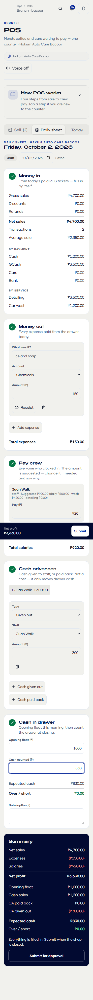
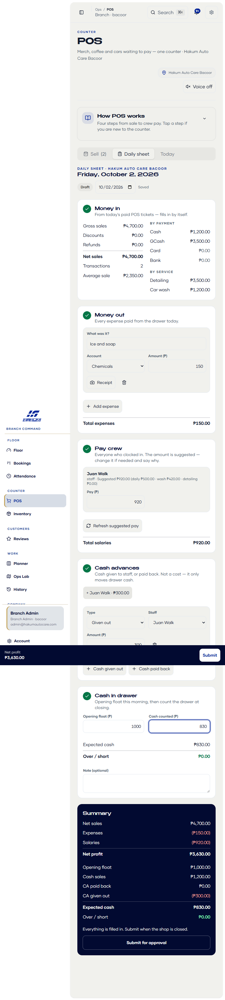
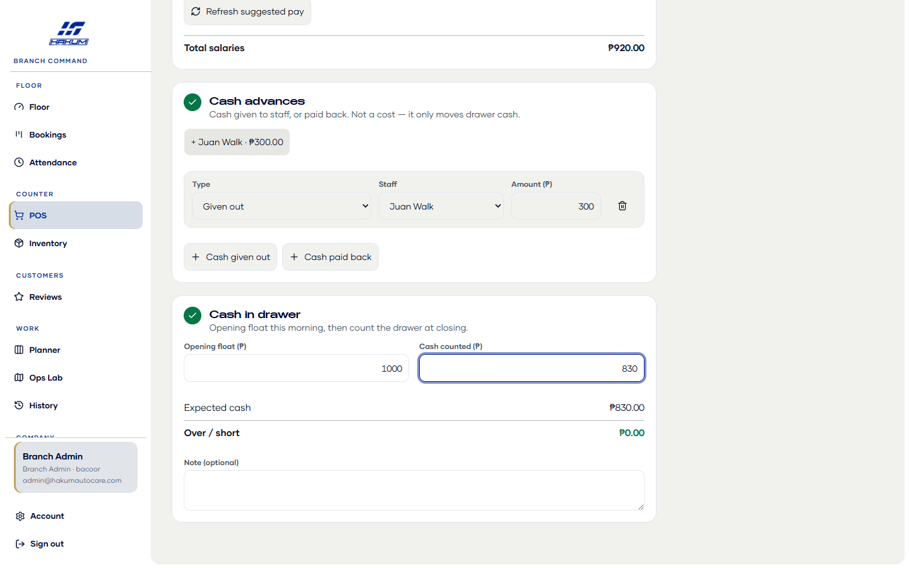

Branch Admin, after Submit — 375 · 1440

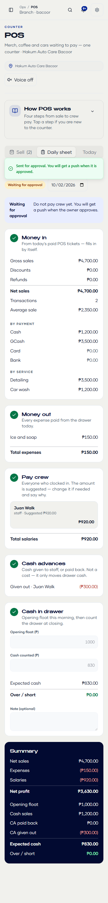
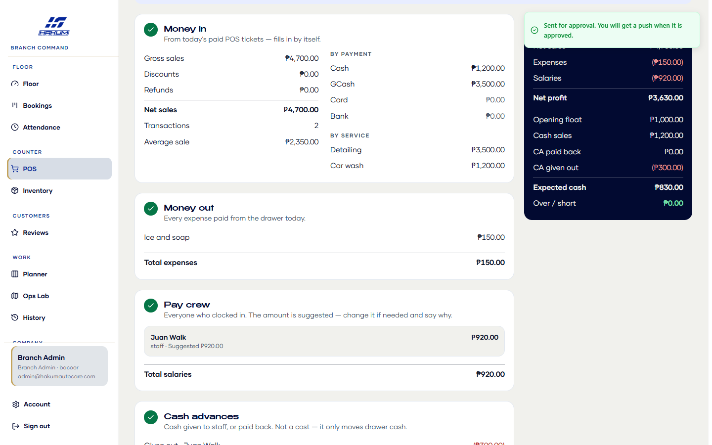

Finance → Daily sheets inbox — 375 · 768 · 1440

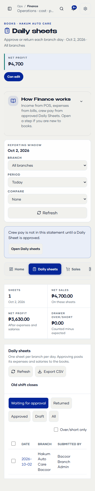
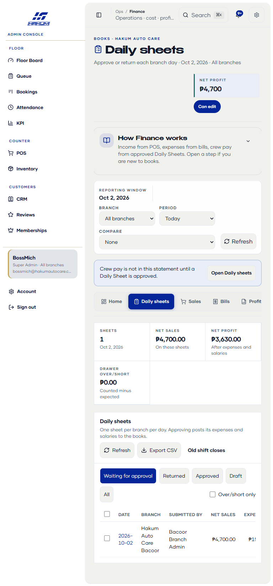
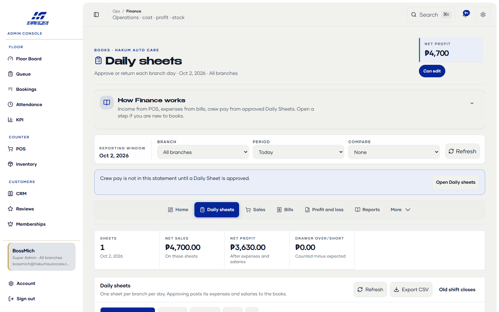

Review drawer — 375 · 768 · 1440

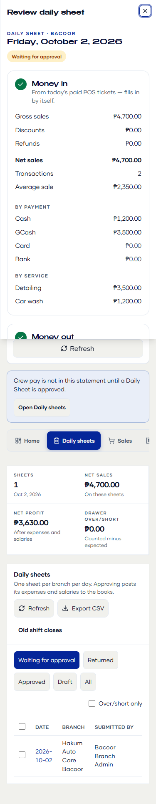
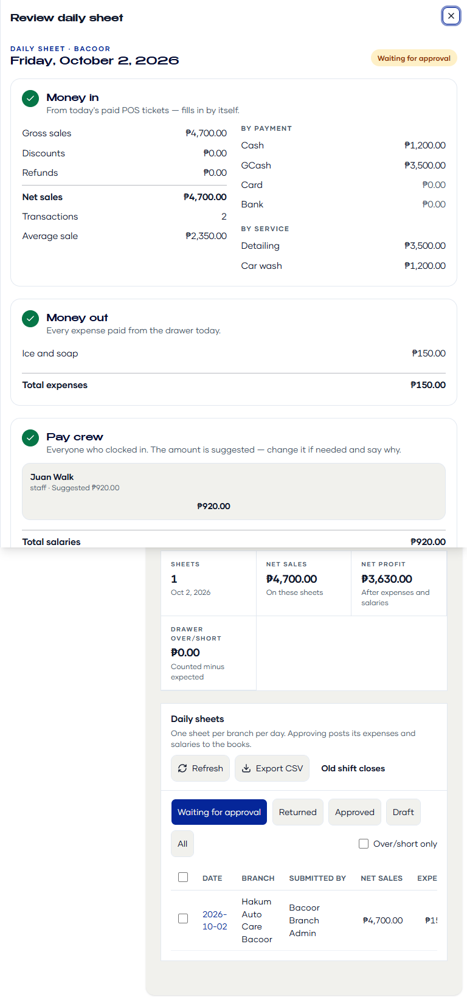
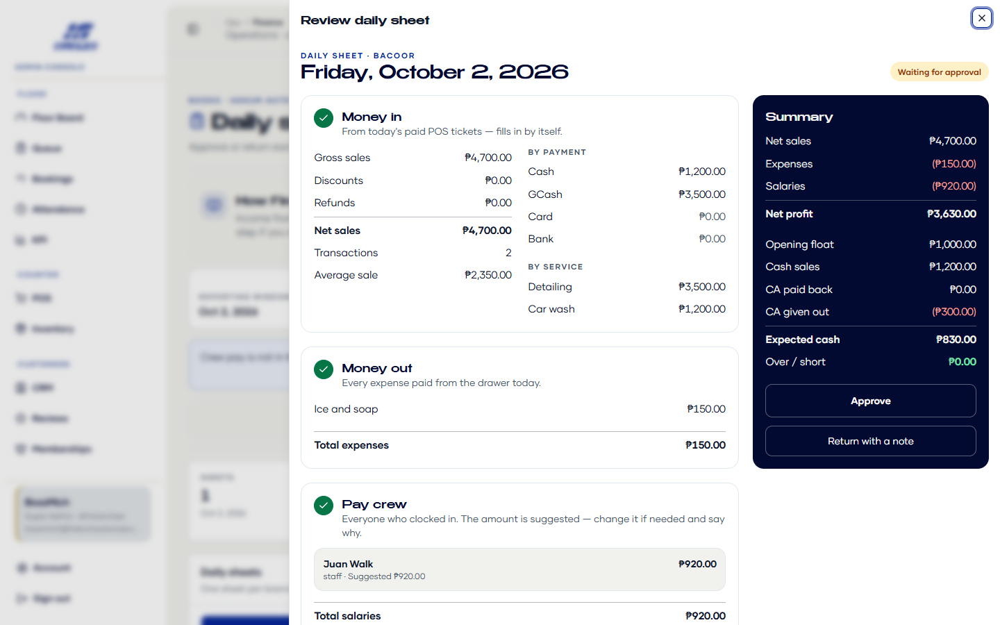

P&L after approval — 375 · 768 · 1440

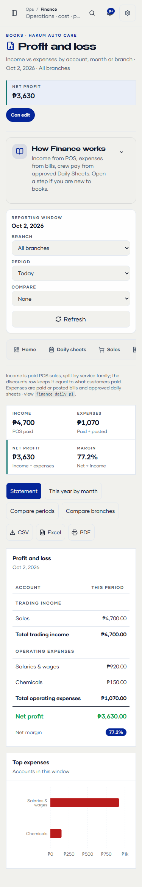
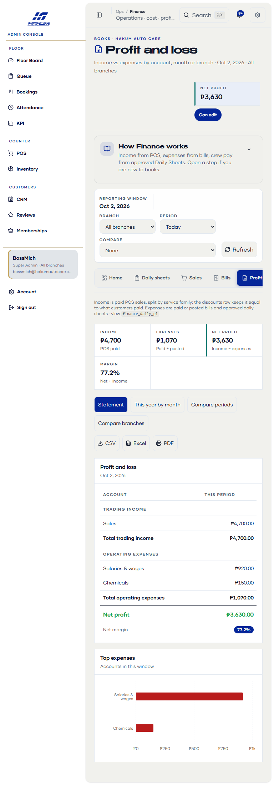
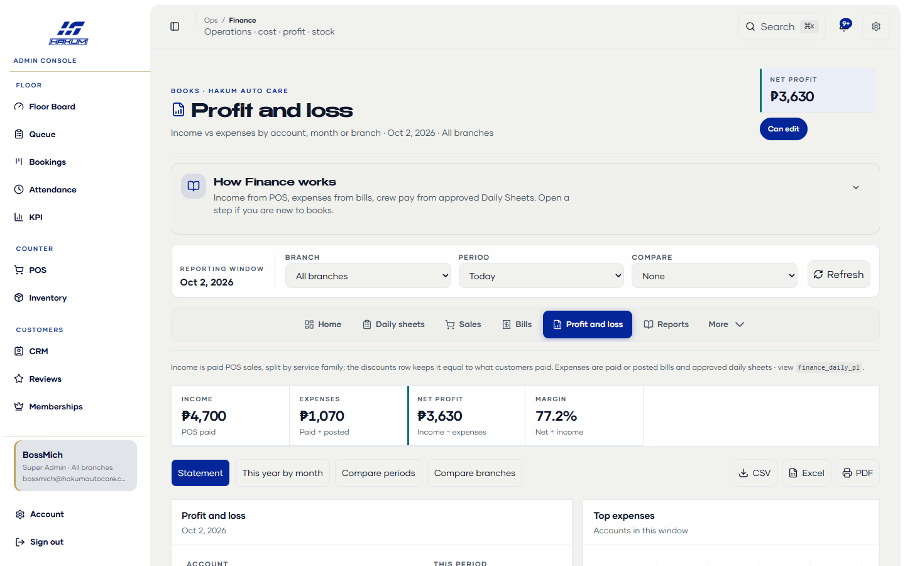

## Compared with Xero and Square

| Area | Have | Not built (by choice, not in this plan) |
|---|---|---|
| Day close (Square close-of-day) | Gross / discounts / refunds / net, by payment method, by service, opening float, paid out, cash advances, expected vs counted, over/short with required note | Printed close-of-day slip per sheet (CSV export of sheets exists) |
| Approvals (Xero) | Draft → Submitted → Approved / Returned, approve-once posting, Super Admin reopen voids posted rows, every decision in the audit log | — |
| Bills (Xero) | From, date, due date, reference, multi-line, account, branch, receipt | Overdue / aged payables view, bill payments against a due balance |
| Reports (Xero) | P&L by account, compare periods or branches, CSV / Excel / PDF | Balance sheet, bank reconciliation |
| Tax | — | VAT / tax rates on sales and bills |

## Known follow-ups

- Server paths with no caller left in the app: the `shift_submitted` push in `server/notifyOpsEvent.mjs`, `POST /api/notify-shift-close` (`server/notifyShiftCloseApi.mjs`, `server/notifyShiftClose.mjs`) and the `shift_*` / `floor_pay_ready` rules in `src/lib/notifyRouting.js`. Safe to delete in a cleanup pass with their tests.
- Legacy library code with no caller left in the app: 35 of the 40 exports in `src/lib/payroll.js` (the app still uses `buildPayrollPreview`, `shiftClosePayrollCoverage`, `enrichCashAdvancePayload`, `applyFloorPreviewToBacoorReport`, `FIXED_SALARY_BOOKS_BRANCH`), 19 of the 24 in `src/lib/shiftClose.js`, plus `cashAdvanceVisibleOnPos` (`posSale.js`) and `approvedCaForCloseDay` (`bacoorDailyReport.js`). They are still imported by ~25 legacy test files and by the live e2e scripts above, which run against today's un-migrated production. Remove them in one pass together with the server paths and the e2e rewrite after release step 1 — removing them earlier breaks those scripts.
- Dropping the locked payroll tables is a separate migration that needs the owner's OK.
- Live production e2e scripts still drive the old RPCs and will fail once the migration revokes them: `e2e-lifecycle-flops.mjs`, `e2e-lifecycle-day.mjs`, `e2e-shift-close-money.mjs` (`npm run e2e:shift-close-money`) and `e2e-shift-close-reopen.mjs` call `submit_shift_close` / `review_shift_close` / `run_payroll`. Rewrite them onto `save_daily_sheet` → `submit_daily_sheet` → `review_daily_sheet` right after release step 1, when they can be run against the migrated database. `docs/qa/SHOP-DAY-RUNBOOK.md` and `docs/OPS/MONEY-CONTRACT.md` describe that old flow until then.
