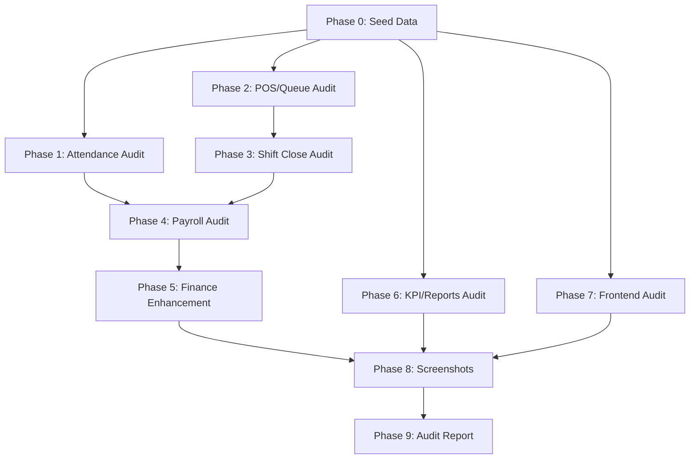

# Full System Audit and Test Plan

> **Skills active:** writing-plans, finish-goal, fullstack-developer, verify, tdd, frontend-design

**Goal:** Prove the entire Hakum daily-operations flow works end-to-end across multiple branches, with realistic data, then screenshot every page for visual review and save a permanent audit folder.

**Architecture:** Local seed script inserts a full month of multi-branch operations data (Bacoor + Imus) into Supabase. Existing 156 test files + new integration tests verify each module seam. Puppeteer (already installed) captures every ops + public page at desktop (1440px) and mobile (375px). Results land in `docs/audits/YYYY-MM-DD/`.

**Tech Stack:** Node.js test runner, Puppeteer, Supabase JS, Recharts (already in use), Vite dev server.

---

## Phase 0: Data Population Seed Script

Create `scripts/seed-audit-data.mjs` that inserts a realistic month of operations across Bacoor and Imus branches. This is the foundation every later phase depends on.

**Files:**
- Create: [scripts/seed-audit-data.mjs](scripts/seed-audit-data.mjs)

**Seed data must include:**
- 2 branches (Bacoor, Imus) with `branch_operating_hours` rows (different shifts)
- 8-10 staff across roles: 4 bay crew, 2 detailers, 1 team lead, 1 branch admin per branch
- 30 days of attendance rows: on-time, late (various minutes), absent days, day-off
- 60+ POS `sales` tickets: wash, packages, detailing, merch, mixed payment methods (cash/GCash/card)
- 10+ bookings: detailing bookings with assigned detailer staff, walk-in wash bookings
- 15+ `expenses` rows: daily expenses, CA approved/repaid, salary draft cash-outs, supplies
- 5+ `shift_close_reports`: accepted/locked closes for both branches
- 3+ `payroll_runs` with lines: floor + fixed, including CA deducts and commission lines
- `expense_reports` with category lines (for the ASA expense report tab)
- `expense_categories` if not already seeded
- Customer records linked to bookings and loyalty

**Seam tests to verify seed:** Add `tests/seedAudit.test.js` that source-scans the seed script for required table inserts and verifies row counts after a dry run.

---

## Phase 1: Attendance Module Audit

Verify the full clock-in through payroll-weight pipeline.

**Files:**
- Existing: [src/lib/attendanceGeo.js](src/lib/attendanceGeo.js), [src/lib/compensation.js](src/lib/compensation.js), [src/pages/AttendancePage.jsx](src/pages/AttendancePage.jsx)
- Existing tests: [tests/attendanceGeo.test.js](tests/attendanceGeo.test.js), [tests/attendanceSystem.test.js](tests/attendanceSystem.test.js), [tests/attendanceInsights.test.js](tests/attendanceInsights.test.js), [tests/dailyOpsNetwork.test.js](tests/dailyOpsNetwork.test.js)
- Add: `tests/attendanceAudit.test.js`

**Test scenarios (TDD):**
1. On-time crew: weight = 1.0 (full pool share)
2. Late crew (9:00 on 8:00-16:00 shift): weight = 0.875 (7/8)
3. Late crew (10:30 on 8:00-16:00 shift): weight = 0.6875 (5.5/8)
4. Absent crew: weight = 0, excluded from assignment and pool
5. Multi-branch: Bacoor 8:00-17:00 vs Imus 9:00-18:00, same employee late at 10:00 yields different weights
6. Admin override: manually set time-in changes the weight correctly
7. Heatmap data: 30 days of seed data renders correct present/late/absent counts

---

## Phase 2: POS and Queue Flow Audit

Verify ticket lifecycle from TL queue through POS checkout.

**Files:**
- Existing: [src/pages/PosPage.jsx](src/pages/PosPage.jsx), [src/pages/pos/PosPanels.jsx](src/pages/pos/PosPanels.jsx), [src/pages/TeamLeadQueuePage.jsx](src/pages/TeamLeadQueuePage.jsx)
- Existing tests: [tests/posWorkflowSeam.test.js](tests/posWorkflowSeam.test.js), [tests/posSale.test.js](tests/posSale.test.js), [tests/queuePaymentHandoff.test.js](tests/queuePaymentHandoff.test.js)
- Add: `tests/posFlowAudit.test.js`

**Test scenarios:**
1. TL creates wash ticket -> appears in queue -> BA checks out via POS -> sale recorded with correct `amount_minor`, `payment_method`, `business_date`
2. Detailing booking -> assigned detailer -> POS checkout -> `assigned_staff_id` preserved for commission
3. Walk-in POS detailing -> `detailer_staff_id` set -> commission line generated
4. Merch sale -> no commission, no wash pool
5. Mixed payment (partial cash + GCash) -> correct split in sales row
6. CA repayment via POS -> does NOT count in Total Sales, only adds to cash left
7. Total sales query matches sum of paid POS tickets (contract A1)

---

## Phase 3: End of Shift and Shift Close Audit

Verify the Branch Admin EoS wizard through Finance accept.

**Files:**
- Existing: [tests/shiftClose.test.js](tests/shiftClose.test.js), [tests/shopDaySettlement.test.js](tests/shopDaySettlement.test.js), [src/pages/finance/FinanceShiftCloseTab.jsx](src/pages/finance/FinanceShiftCloseTab.jsx)
- Add: `tests/shiftCloseAudit.test.js`

**Test scenarios:**
1. BA closes shift: drawer attestation vs POS baseline match (variance = 0)
2. BA closes with variance: over/short recorded, SA sees variance on review
3. BA salary draft extras: `salary_draft_extras` JSON appears in SA payroll wizard
4. Finance accept: status changes to `accepted`, pending floor row appears
5. Finance lock: status changes to `locked`, no further edits allowed
6. Missing close blocks payroll confirm (`pending_floor_optional = false`)
7. Day expenses on close: supplies, CA approved -> reduce cash left correctly

---

## Phase 4: Payroll Module Audit

The most complex module. Verify wash pool, commissions, late weights, CA deducts, and fixed salary.

**Files:**
- Existing: [src/lib/compensation.js](src/lib/compensation.js), [src/pages/PayrollPage.jsx](src/pages/PayrollPage.jsx)
- Existing tests: [tests/payrollSeam.test.js](tests/payrollSeam.test.js), [tests/payrollFullStack.test.js](tests/payrollFullStack.test.js), [tests/dailyOpsNetwork.test.js](tests/dailyOpsNetwork.test.js)
- Add: `tests/payrollAudit.test.js`

**Test scenarios (worked example from [docs/user-stories/shop-day-flow.md](docs/user-stories/shop-day-flow.md)):**
1. Wash pool = paid wash POS * 35% * attendance weight (bay crew only, not TL/admin/sales)
2. On-time crew gets full share; late crew gets proportional share
3. Absent crew: zero share, no lines generated
4. Detailing commission: assigned detailer gets % of job revenue (both booking and walk-in POS)
5. Ceramic crew share: separate detailing split, does NOT add to carwash salary cell
6. CA deduct: manual only, appears as negative line, reduces net pay
7. Multi-branch floor: Bacoor and Imus each have separate wash pools from their own branch sales
8. Fixed salary staff: monthly package prorated by attendance days, unaffected by wash pool
9. Pending floor hard gate: cannot confirm without accepted/locked close for each branch-day
10. POS proof totals match Finance P&L income (no close-fiction revenue)

---

## Phase 5: Finance Dashboard and P&L Enhancement

Verify existing Finance tabs work with seed data, then enhance the Overview tab with a P&L summary chart and expense breakdown visible to the owner.

**Files:**
- Existing: [src/pages/finance/FinanceOverviewTab.jsx](src/pages/finance/FinanceOverviewTab.jsx), [src/pages/finance/FinancePLTab.jsx](src/pages/finance/FinancePLTab.jsx), [src/lib/financeData.js](src/lib/financeData.js)
- Existing tests: [tests/financeData.test.js](tests/financeData.test.js), [tests/branchFinanceHardening.test.js](tests/branchFinanceHardening.test.js)
- Modify: `FinanceOverviewTab.jsx` (add P&L summary + expense pie/bar)
- Add: `tests/financeAudit.test.js`

**Enhancements for owner visibility:**
1. **P&L summary card** on Overview: Income, Expenses, Net Profit with delta vs prior period (already partially there via `financeOwnerInsights`)
2. **Expense breakdown bar chart** on Overview: top 6 expense categories (already computed by `topExpenseCategories`, wire it into Overview alongside the existing cash-flow trend)
3. **Branch comparison strip**: sales by branch side-by-side (already computed by `salesByBranch`, add a small bar chart)
4. **Export buttons**: CSV/Excel/PDF on Overview for the owner (reuse existing `downloadCsv`, `downloadExcel`, `printAsPdf` from financeData.js)

**Test scenarios:**
1. `rollupPl` with seed data returns correct income/expense/net
2. `topExpenseCategories` returns categories sorted by spend
3. `salesByBranch` returns both Bacoor and Imus with correct totals
4. `financeOwnerInsights` returns actionable copy (not empty)
5. P&L tab export CSV matches displayed rows
6. Shift Close tab shows accepted/locked closes with correct variance
7. Expense Reports tab shows submitted reports with category totals

---

## Phase 6: KPI and Reports Module Audit

Verify the KPI dashboard and Finance Reports tab provide accurate owner-facing data.

**Files:**
- Existing: [src/pages/KpiPage.jsx](src/pages/KpiPage.jsx), [src/pages/finance/FinanceReportsTab.jsx](src/pages/finance/FinanceReportsTab.jsx), [src/pages/SuperAdminFloorBoard.jsx](src/pages/SuperAdminFloorBoard.jsx)
- Existing tests: [tests/kpiPart8.test.js](tests/kpiPart8.test.js), [tests/superAdminFloor.test.js](tests/superAdminFloor.test.js)
- Add: `tests/reportsAudit.test.js`

**Test scenarios:**
1. KPI Crew tab: completion count, avg cycle time, avg wait time match seed data
2. KPI Branch Compare: Bacoor vs Imus completed count correct
3. KPI Sales tab: revenue matches POS totals
4. Finance Reports tab: sales report, ops summary, retention buckets, best sellers — all non-empty with seed data
5. SuperAdminFloorBoard: stat tiles (queued, in-progress, done, revenue) match seed data
6. Floor Board lanes: wash + detailing + packages all show jobs

---

## Phase 7: Frontend Redundancy and UI Audit

Walk every ops page, check for dead controls, redundant features, and alignment issues.

**Files:**
- Existing tests: [tests/uiDeadControls.test.js](tests/uiDeadControls.test.js), [tests/leftoverUxSeam.test.js](tests/leftoverUxSeam.test.js)
- Add: `tests/frontendAudit.test.js`

**Checks:**
1. Source-scan every page component for buttons/links that have no `onClick` or `href` (dead controls)
2. Source-scan for `console.log` / `console.warn` / `console.error` left in page components
3. Verify every tab in Finance, KPI, Attendance, Payroll renders (no crash on empty data)
4. Check responsive: mobile breakpoints don't overflow (tested via Puppeteer viewport)
5. Check off-states: empty data shows a helpful cue, not a blank screen
6. Verify no duplicate routes or redundant page components

---

## Phase 8: Puppeteer Screenshot Harness

Create `scripts/screenshot-audit.mjs` that launches a dev server, logs in as Super Admin, and captures every ops page at desktop (1440x900) and mobile (375x812).

**Files:**
- Create: [scripts/screenshot-audit.mjs](scripts/screenshot-audit.mjs)
- Output: `docs/audits/YYYY-MM-DD/screenshots/`

**Page list (from [src/App.jsx](src/App.jsx) routes):**

Operations pages (27 routes):
- `/operations/console`, `/operations/dashboard`, `/operations/queue`, `/operations/crew`
- `/operations/attendance` (clock, register, settings tabs)
- `/operations/kpi` (crew, compare, service, sales tabs)
- `/operations/pos`, `/operations/inventory`, `/operations/bookings`
- `/operations/finance` (overview, sales, purchases, pl, shift-close, expense-reports, vendors, quotes, corporate, categories, reports tabs)
- `/operations/payroll` (each wizard step)
- `/operations/crm`, `/operations/planning`, `/operations/settings`
- `/operations/people`, `/operations/branches`, `/operations/cars`
- `/operations/audit`, `/operations/data-center`, `/operations/notifications`

Public pages (12 routes):
- `/home`, `/services`, `/packages`, `/book`, `/queue`, `/branches`, `/contact`, `/events`, `/blog`

**Naming convention:** `{route-slug}--{tab}--{viewport}.png`
Example: `finance--pl--desktop.png`, `attendance--register--mobile.png`

---

## Phase 9: Audit Report and Owner Revisions Tracker

Compile all results into a permanent folder.

**Files:**
- Create: `docs/audits/YYYY-MM-DD/README.md` — master audit index
- Create: `docs/audits/YYYY-MM-DD/OWNER-REVISIONS.md` — owner comments tracker
- Create: `docs/audits/YYYY-MM-DD/screenshots/` — all Puppeteer captures
- Create: `docs/audits/YYYY-MM-DD/test-results.txt` — full `node --test` output

**README.md structure:**
- Date, branch, commit SHA
- Test summary: X passed, Y failed, Z skipped
- Screenshot gallery: each page with desktop + mobile thumbnails
- Module status: Attendance (pass/fail), Payroll (pass/fail), Finance (pass/fail), etc.
- Known issues / open items
- Link to OWNER-REVISIONS.md for revision tracking

**OWNER-REVISIONS.md structure:**
- Table: ID, Page, Comment, Status (open/resolved/wontfix), Resolved-in (commit SHA)
- Pre-populated with any known owner feedback from [docs/OPS/NEW-REVISIONS-CHECKLIST.md](docs/OPS/NEW-REVISIONS-CHECKLIST.md)

---

## Execution Flow

---

## Verification Gate (per phase)

Each phase is not complete until:
1. All new tests pass: `node --test tests/{phase}Audit.test.js` exits 0
2. All existing related tests still pass (no regressions)
3. `npm run build` exits 0
4. `npx eslint .` exits 0 (or no new warnings)
5. Screenshots captured for that module's pages (Phase 8)

## Save Plan

Save to: `docs/plans/2026-08-31-full-system-audit.md`
