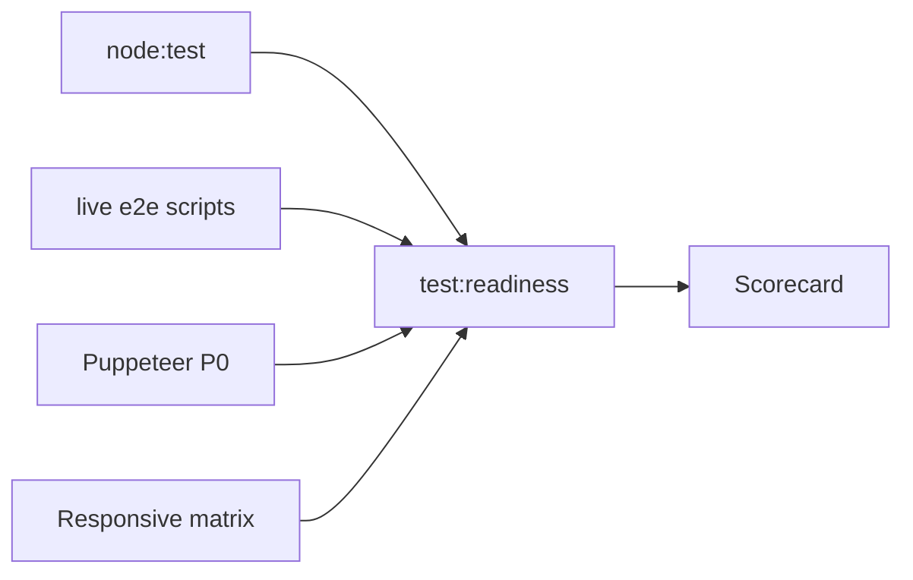
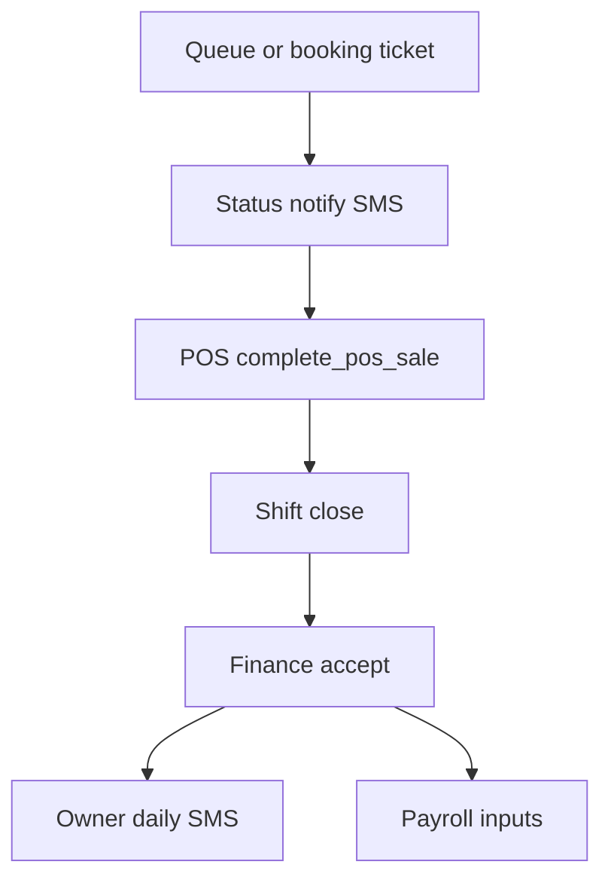

# Hakum — Ultimate Readiness Checklist

**Purpose:** Principal QA gate for soft launch → production ops.  
**Orchestrator:** `npm run test:readiness` → [`scripts/e2e-ultimate-readiness.mjs`](../../scripts/e2e-ultimate-readiness.mjs)  
**Bug register:** [`BUGS.md`](./BUGS.md)  
**Rule:** Do not mark `[x]` without exit **0** (or signed manual proof) from **this campaign**.

Last readiness run: **2026-09-13T16:02:59.235Z** (ok=true passed=14 failed=0)
Artifact: [`last-run.json`](./last-run.json) · [`readiness-dashboard.html`](./readiness-dashboard.html) · [`RESULTS.md`](./RESULTS.md)



---

## Gate 0 — Entry

| # | Check | Command | Status |
|---|--------|---------|--------|
| 0.1 | Unit suite | `npm test` | [x] |
| 0.2 | Production build | `npm run build` | [x] |
| 0.3 | Ultimate orchestrator | `npm run test:readiness` | [x] |

---

## Gate FLOPS — Soft-launch shop day

**Runbook:** [`SHOP-DAY-RUNBOOK.md`](./SHOP-DAY-RUNBOOK.md) · **Evidence index:** [`MONEY-PATH-EVIDENCE-INDEX.md`](./MONEY-PATH-EVIDENCE-INDEX.md) · **Sign-off:** [`BRANCH-DAY-SIGN-OFF.md`](./BRANCH-DAY-SIGN-OFF.md)

| # | Check | Command | Status |
|---|--------|---------|--------|
| F.1 | Unified mutating lifecycle + screenshots + recording | `npm run e2e:lifecycle-flops` | [x] 2026-09-24 23/23 |
| F.2 | Paid-by-kind SQL = Finance UI for QA day | FLOPS + `execute_sql` | [x] kind=drawer=900000 |
| F.3 | Accepted close drawer = paid kind sum | FLOPS E1/F1 | [x] |
| F.4 | Floor payroll confirmed for that window | FLOPS P1 | [x] 157500 · overlap blocks 2nd run |
| F.5 | TL POS deny + Investor payroll deny | FLOPS R1 | [x] Lane closed |

Soft-launch shop-day ready requires F.1–F.5 exit 0 with fresh artifacts. Production SMS/SMTP remains Gate 7 / Gate 10.

---

## 1 — Auth / session / RBAC

| # | Check | Command | Status |
|---|--------|---------|--------|
| 1.1 | Permissions matrix | covered by `npm test` (`permissions` / `principalQaMatrix`) | [x] |
| 1.2 | Session helpers | covered by `npm test` (`session`) | [x] |
| 1.3 | Live RBAC logins | `node scripts/e2e-rbac-matrix.mjs` | [ ] not in orchestrator |
| 1.4 | UI ops login (admin/TL/staff) | `node scripts/e2e-ui-p0.mjs` | [x] |
| 1.5 | UI customer sign-in | `node scripts/e2e-ui-p0.mjs` | [x] |

---

## 2 — Customer portal

| # | Check | Command | Status |
|---|--------|---------|--------|
| 2.1 | Auth / onboarding units | covered by `npm test` | [x] |
| 2.2 | Portal regression | readiness / live slices | [x] |
| 2.3 | UI `/account` after login | `e2e-ui-p0` | [x] |

---

## 3 — Transactional floor (queue → SMS → POS → money)

| # | Check | Command | Status |
|---|--------|---------|--------|
| 3.1 | Queue logic unit | covered by `npm test` | [x] |
| 3.2 | Live queue | `node scripts/e2e-queue-part3.mjs` | [x] |
| 3.3 | POS units + live | `npm test` + `e2e-pos-part2` | [x] |
| 3.4 | POS handoff smoke | `node scripts/smoke-pos-handoff.mjs` | [x] 2026-09-24 exit 0 |
| 3.5 | Status SMS DLR (opt-in) | `SEND_LIVE_SMS=1 …e2e-real-customer-status-sms.mjs` | [x] proven earlier this campaign (21/21, DELIVRD); skipped in last orch (`SEND_LIVE_SMS` unset) |
| 3.6 | UI queue + POS pages authed | `e2e-ui-p0` | [x] |
| 3.7 | Ops cutover slice | `npm run e2e:cutover` | [x] |

---

## 4 — Attendance / crew / payroll

| # | Check | Command | Status |
|---|--------|---------|--------|
| 4.1 | Attendance geo unit | covered by `npm test` | [x] |
| 4.2 | Live attendance | `node scripts/e2e-attendance.mjs` | [x] |
| 4.3 | UI attendance page | `e2e-ui-p0` | [x] |
| 4.4 | Payroll | `npm run e2e:payroll` | [x] |
| 4.5 | Crew / tasks | `node scripts/e2e-part4-crew-tasks.mjs` | [ ] not in orchestrator |

---

## 5 — CRM / bookings / detailing

| # | Check | Command | Status |
|---|--------|---------|--------|
| 5.1 | CRM + bookings live | `node scripts/e2e-part7-crm-bookings.mjs` | [ ] not in orchestrator |
| 5.2 | Detailing status contract | covered by `npm test` | [x] |

---

## 6 — Inventory / merch

| # | Check | Command | Status |
|---|--------|---------|--------|
| 6.1 | Stock helpers | covered by `npm test` | [x] |
| 6.2 | Data integrity | `npm run e2e:integrity` | [x] 2026-09-24 PASS |
| 6.3 | CHEM-RECON | Manual / seed | [ ] |

---

## 7 — Admin / SMS / push

| # | Check | Command | Status |
|---|--------|---------|--------|
| 7.1 | SMS gate unit | covered by `npm test` | [x] |
| 7.2 | BusyBee balance (no send) | `smoke-busybee` soft-fail in orch | [~] soft-pass only (Windows crash exit on smoke; non-blocking) |
| 7.3 | Push wiring | `node scripts/e2e-push-notifications.mjs` | [x] 2026-09-24 PASS |
| 7.4 | Vercel BrandTxt IP (customer outbound reminders) | Ops | [ ] **BLOCKED** — office egress now `180.191.244.237` (ErrorCode 11); old `180.190.249.189` stale; Vercel Static IPs still required |
| 7.5 | Owner daily SMS / `OWNER_SMS_PHONE` | Product policy | [x] **N/A** — disabled; push only (`owner_sms_disabled`) |

---

## 8 — Public / marketing

| # | Check | Command | Status |
|---|--------|---------|--------|
| 8.1 | Catalog / home units | covered by `npm test` | [x] |
| 8.2 | Responsive public pages | `responsive-validation.mjs` | [x] CONDITIONAL (touch targets on book) |

---

## 9 — Responsive / orientation

| # | Check | Command | Status |
|---|--------|---------|--------|
| 9.1 | 8 viewports + landscape | `responsive-validation.mjs` | [x] CONDITIONAL fail=0 |
| 9.2 | Report | [`responsive-report.md`](./responsive-report.md) | [x] |

---

## 10 — Ops / deploy residuals

| # | Check | Proof | Status |
|---|--------|-------|--------|
| 10.1 | Auth SMTP | Dashboard | [ ] |
| 10.2 | Vercel secret parity | Env audit | [ ] |
| 10.3 | Observability | Sentry or accepted risk | [ ] |

---

## Money path (must stay honest)



---

## Score targets

| Layer | Target |
|-------|--------|
| Unit | 100% green |
| Live API e2e (orchestrator slices) | 100% green |
| UI P0 | 100% of flows in `e2e-ui-p0` |
| Responsive | PASS or CONDITIONAL (cosmetic only) |
| Ops blockers | Documented; not claimed fixed without evidence |

---

## Phase F — Scorecard (2026-09-03)

| Layer | Result | Evidence |
|-------|--------|----------|
| Unit | **PASS** | orch step U · includes `e2eUiMoneyContract` |
| Live API (attendance, payroll, readiness, queue, pos) | **PASS** | L1–L5 |
| Ops cutover (API) | **PASS** | L8 · WARN CHEM-RECON / OWNER_SMS env |
| Build | **PASS** | B |
| UI P0 | **PASS** | UI |
| UI money (BUG-007 surfaces) | **PASS** 5/5 | UI2 · [`e2e-evidence/ui-money`](../../e2e-evidence/ui-money) |
| Responsive | **CONDITIONAL** fail=0 | R · book touch targets |
| Live status SMS DLR | **PASS** (campaign) | earlier run; L7 skipped when `SEND_LIVE_SMS` unset |
| BusyBee balance smoke | **SOFT** | L6 softFail |
| Destructive EoS submit → finance accept | **PASS** | L9 · [`e2e-shift-close-money.mjs`](../../scripts/e2e-shift-close-money.mjs) |
| Prod SMS egress / owner phone / SMTP / CHEM-RECON | **OPEN (ops)** | BUG-002…004, 10.x (QA recon seeded; prod approval still pending) |

### Verdict

**Soft-launch code gate: MET** (unit + live API + cutover + UI P0 + money UI surfaces + responsive CONDITIONAL).

**100% production ops gate: NOT MET.**

Living log: [`RESULTS.md`](./RESULTS.md)

### Residual risks (do not bury)

1. **VERCEL-SMS-IP / office egress** — BrandTxt ErrorCode **11** on **`180.191.244.237`** (2026-09-24). Paste [`docs/OPS/brandtxt-dexter-followup.txt`](../OPS/brandtxt-dexter-followup.txt) to Dexter; Static IPs: [`docs/OPS/VERCEL-STATIC-IPS.md`](../OPS/VERCEL-STATIC-IPS.md). Tracker: [`docs/OPS/ADMIN-DAILY-OPS-TRACKER.md`](../OPS/ADMIN-DAILY-OPS-TRACKER.md).
2. ~~**OWNER_SMS_PHONE**~~ — **N/A** — owner daily SMS disabled; Finance accept uses web push.
3. **Auth SMTP** — [`docs/OPS/AUTH-SMTP-PROOF.md`](../OPS/AUTH-SMTP-PROOF.md) (project `lybxhpzzqqyqswvuwpxv`). Admin UI: **no redesign** — [`docs/qa/ADMIN-FRICTION-LOG.md`](./ADMIN-FRICTION-LOG.md).
4. **BUG-007 residual** — FLOPS 2026-09-24 exercised browser role path through POS/EoS/finance/payroll evidence; keep money-path e2e as regression.
5. **CHEM-RECON** — QA recon seeded; production recon approval workflow still pending.
6. **BusyBee smoke** — soft-fail Windows crash exit.
7. **Book page** — compact touch targets (CONDITIONAL).

### How to re-verify

```bash
npm run test:readiness
# optional: SEND_LIVE_SMS=1
# money only: npm run e2e:ui-money
```

---

**Continue?** Not yet 100% messaging. Next: BrandTxt IP whitelist for **customer outbound reminders**, Auth SMTP proof if needed. Owner SMS is intentionally out of scope.
